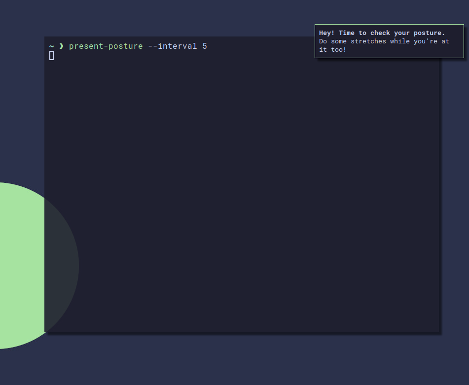

# Present Posture
## An extremely oversimplified posture check notification program written in Go!


## Usage
```
present-posture --interval <interval until next notification, in seconds (default is 900)>
```

For more detailed usage:
```
present-posture -h
```

## Notes
- This is a completely personal project that is not 100% guaranteed to be the best solution to the problem (or a safe one at that!).
- This is my first experience with Go, so it might show.
- I've only tested this with Arch Linux, running i3-gaps and dunst.

## Dependencies
- A notification manager like `dunst`,
- `libnotify` (this comes with the `notify-send` command). On Arch Linux, run `sudo pacman -S libnotify`.

## Installation
- `git clone https://github.com/mattishere/Present-Posture.git && cd Present-Posture`
- `make install` (note: you may have to run this as root)
- That's it!

## Uninstallation
- Go into the cloned repository directory
- Run `make uninstall` (note: you may have to run this as root)
